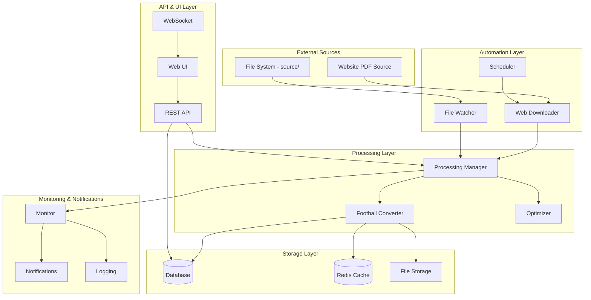
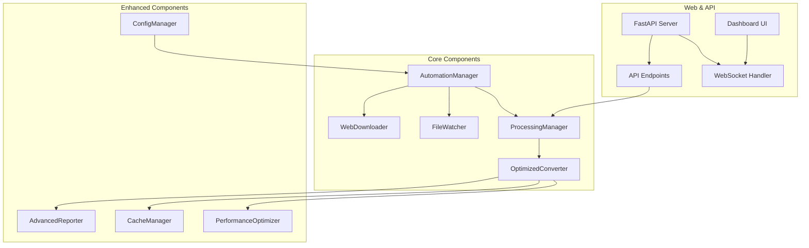

# Design Document

## Overview

Ez a design dokumentum a football data processing rendszer teljes automatizálását és optimalizálását tervezi meg. A megoldás egy event-driven architektúrát használ, amely automatikus PDF letöltést, file monitoring-ot, teljesítmény optimalizálást, fejlett riportolást, webes felületet és API-t biztosít. A rendszer Docker konténerekben fut és könnyen skálázható.

A fejlesztés a meglévő football-data-enhancement spec-re épül, azt kiegészítve automatizálási és optimalizálási funkciókkal.

## Architecture

### High-Level Architecture



### Component Architecture



## Components and Interfaces

### 1. AutomationManager

**Purpose**: Központi koordinátor az automatizálási folyamatokhoz.

**Interface**:
```python
class AutomationManager:
    def __init__(self, config: AutomationConfig)
    async def start(self) -> None
    async def stop(self) -> None
    async def schedule_download(self) -> None
    async def process_file(self, file_path: str) -> ProcessingResult
    def get_status(self) -> AutomationStatus
```

**Configuration**:
```json
{
  "web_downloader": {
    "url": "https://example.com/football-data",
    "check_interval": 3600,
    "download_path": "source/",
    "max_retries": 3
  },
  "file_watcher": {
    "watch_path": "source/",
    "file_patterns": ["*.pdf"],
    "debounce_time": 5
  },
  "processing": {
    "max_concurrent": 2,
    "retry_attempts": 3,
    "timeout": 300
  }
}
```

### 2. WebDownloader

**Purpose**: Automatikus PDF letöltés weboldalról.

**Interface**:
```python
class WebDownloader:
    def __init__(self, config: WebDownloaderConfig)
    async def check_for_new_files(self) -> List[FileInfo]
    async def download_file(self, file_info: FileInfo) -> DownloadResult
    async def get_latest_file_info(self) -> Optional[FileInfo]
    def is_file_newer(self, remote_file: FileInfo, local_file: Path) -> bool
```

**Features**:
- HTTP/HTTPS támogatás custom headers-szel
- Conditional requests (If-Modified-Since, ETag)
- Resume capability megszakított letöltésekhez
- Rate limiting és retry logic
- Checksum verification

### 3. FileWatcher

**Purpose**: File system monitoring új PDF fájlokhoz.

**Interface**:
```python
class FileWatcher:
    def __init__(self, config: FileWatcherConfig)
    async def start_watching(self) -> None
    async def stop_watching(self) -> None
    def add_handler(self, handler: Callable[[FileEvent], Awaitable[None]]) -> None
    def remove_handler(self, handler: Callable) -> None
```

**Implementation**: 
- `watchdog` library használata
- Debouncing logic a gyors file változásokhoz
- File lock detection
- Pattern matching támogatás

### 4. OptimizedConverter

**Purpose**: Teljesítmény-optimalizált verzió a FootballConverter-nek.

**Interface**:
```python
class OptimizedConverter(FootballConverter):
    def __init__(self, config: OptimizationConfig)
    async def convert_football_async(self, json_file_path: str) -> ProcessingResult
    def enable_caching(self, cache_manager: CacheManager) -> None
    def enable_streaming(self, chunk_size: int = 1024) -> None
    def get_performance_metrics(self) -> PerformanceMetrics
```

**Optimizations**:
- Streaming JSON parsing nagy fájlokhoz
- Parallel processing a team normalization-höz
- Caching a regex patterns és team aliases-hez
- Memory-mapped files nagy PDF-ekhez
- Batch processing a database operations-höz

### 5. CacheManager

**Purpose**: Redis-based caching a teljesítmény javításához.

**Interface**:
```python
class CacheManager:
    def __init__(self, redis_config: RedisConfig)
    async def get(self, key: str) -> Optional[Any]
    async def set(self, key: str, value: Any, ttl: int = 3600) -> None
    async def invalidate_pattern(self, pattern: str) -> None
    async def get_stats(self) -> CacheStats
```

**Cache Strategies**:
- Team normalization results (TTL: 24h)
- Market classification patterns (TTL: 12h)
- Processing results (TTL: 1h)
- Configuration data (TTL: 30min)

### 6. AdvancedReporter

**Purpose**: Fejlett riportolás és analytics.

**Interface**:
```python
class AdvancedReporter(ReportGenerator):
    def __init__(self, config: ReportingConfig)
    async def generate_trend_analysis(self, days: int = 30) -> TrendReport
    async def generate_anomaly_report(self) -> AnomalyReport
    async def generate_dashboard_data(self) -> DashboardData
    async def export_to_formats(self, data: Any, formats: List[str]) -> Dict[str, str]
```

**Enhanced Features**:
- Time-series analysis
- Anomaly detection algorithms
- Interactive dashboard data
- Multiple export formats (JSON, CSV, Excel, PDF)
- Real-time metrics

### 7. ProcessingManager

**Purpose**: Központi feldolgozás koordináció és queue management.

**Interface**:
```python
class ProcessingManager:
    def __init__(self, config: ProcessingConfig)
    async def queue_file(self, file_path: str, priority: int = 0) -> str
    async def get_queue_status(self) -> QueueStatus
    async def cancel_job(self, job_id: str) -> bool
    async def retry_failed_job(self, job_id: str) -> bool
    def add_progress_callback(self, callback: Callable) -> None
```

**Features**:
- Priority queue system
- Job persistence
- Progress tracking
- Failure recovery
- Concurrent processing limits

## Data Models

### Enhanced Game Model

```python
@dataclass
class EnhancedGame:
    # Existing fields from original Game model
    league: str
    date: str
    iso_date: str
    time: str
    home_team: str
    away_team: str
    original_home_team: str
    original_away_team: str
    main_market: Market
    additional_markets: List[Market]
    
    # New enhanced fields
    processing_metadata: ProcessingMetadata
    quality_score: float
    confidence_scores: Dict[str, float]
    trend_data: Optional[TrendData]
    anomaly_flags: List[AnomalyFlag]
    
@dataclass
class ProcessingMetadata:
    job_id: str
    processing_time: float
    cache_hits: int
    cache_misses: int
    optimization_applied: List[str]
    performance_metrics: PerformanceMetrics
```

### Configuration Models

```python
@dataclass
class AutomationConfig:
    web_downloader: WebDownloaderConfig
    file_watcher: FileWatcherConfig
    processing: ProcessingConfig
    caching: CacheConfig
    notifications: NotificationConfig
    monitoring: MonitoringConfig

@dataclass
class WebDownloaderConfig:
    url: str
    check_interval: int
    download_path: str
    max_retries: int
    headers: Dict[str, str]
    timeout: int
    verify_ssl: bool
```

## API Design

### REST API Endpoints

```python
# Processing endpoints
POST /api/v1/process/file
GET /api/v1/process/status/{job_id}
GET /api/v1/process/queue
DELETE /api/v1/process/job/{job_id}

# Data endpoints
GET /api/v1/games
GET /api/v1/games/{date}
GET /api/v1/reports/latest
GET /api/v1/reports/trends

# Configuration endpoints
GET /api/v1/config
PUT /api/v1/config
POST /api/v1/config/reload

# Monitoring endpoints
GET /api/v1/health
GET /api/v1/metrics
GET /api/v1/status
```

### WebSocket Events

```python
# Real-time events
{
  "type": "processing_started",
  "data": {"job_id": "...", "file": "..."}
}

{
  "type": "processing_progress",
  "data": {"job_id": "...", "progress": 45, "stage": "normalization"}
}

{
  "type": "processing_completed",
  "data": {"job_id": "...", "result": {...}}
}

{
  "type": "new_file_detected",
  "data": {"file": "...", "source": "web_download"}
}
```

## Web UI Design

### Dashboard Components

1. **Status Overview**
   - Real-time processing status
   - Queue length and active jobs
   - System health indicators
   - Recent activity timeline

2. **Data Visualization**
   - Interactive charts (Chart.js/D3.js)
   - Game statistics by league/date
   - Market coverage analysis
   - Trend visualization

3. **Configuration Panel**
   - Dynamic form generation
   - Real-time validation
   - Configuration preview
   - Rollback capability

4. **File Management**
   - Drag-and-drop upload
   - File browser
   - Processing history
   - Download processed files

### Technology Stack

- **Frontend**: React + TypeScript
- **UI Components**: Material-UI vagy Ant Design
- **Charts**: Chart.js vagy Recharts
- **State Management**: Redux Toolkit
- **WebSocket**: Socket.io-client

## Performance Optimizations

### Memory Optimization

1. **Streaming Processing**
   ```python
   async def stream_process_large_file(file_path: str):
       async with aiofiles.open(file_path, 'rb') as f:
           async for chunk in read_chunks(f, chunk_size=1024*1024):
               yield process_chunk(chunk)
   ```

2. **Memory Pooling**
   - Object pools a gyakran használt objektumokhoz
   - Buffer reuse a file operations-höz

### CPU Optimization

1. **Parallel Processing**
   ```python
   async def parallel_team_normalization(matches: List[Match]) -> List[Match]:
       semaphore = asyncio.Semaphore(cpu_count())
       tasks = [normalize_match_teams(match, semaphore) for match in matches]
       return await asyncio.gather(*tasks)
   ```

2. **Compiled Regex**
   - Pre-compiled regex patterns
   - Pattern caching

### I/O Optimization

1. **Async File Operations**
   - `aiofiles` használata
   - Batch file writes

2. **Database Connection Pooling**
   - SQLAlchemy async pool
   - Connection reuse

## Caching Strategy

### Cache Layers

1. **Application Cache** (In-Memory)
   - Regex patterns
   - Configuration data
   - Frequently accessed lookups

2. **Distributed Cache** (Redis)
   - Processing results
   - Team normalization mappings
   - Market classifications

3. **File System Cache**
   - Processed JSON files
   - Generated reports

### Cache Invalidation

```python
class CacheInvalidationStrategy:
    def on_config_change(self, config_key: str):
        # Invalidate related cache entries
        
    def on_new_data(self, data_type: str):
        # Invalidate stale data caches
        
    def on_time_based(self):
        # TTL-based invalidation
```

## Error Handling and Monitoring

### Error Categories

1. **Network Errors**: Connection timeouts, DNS failures
2. **File System Errors**: Permission issues, disk space
3. **Processing Errors**: Invalid data, parsing failures
4. **Configuration Errors**: Invalid settings, missing files

### Monitoring Strategy

```python
@dataclass
class SystemMetrics:
    processing_queue_length: int
    active_jobs: int
    cache_hit_ratio: float
    memory_usage: float
    cpu_usage: float
    disk_usage: float
    error_rate: float
    average_processing_time: float
```

### Alerting Rules

- Queue length > 10 items
- Error rate > 5% in 5 minutes
- Memory usage > 80%
- Processing time > 2x average
- Failed downloads > 3 in 1 hour

## Security Considerations

### Authentication & Authorization

- JWT tokens az API-hoz
- Role-based access control
- API key management
- Rate limiting

### Data Security

- Input validation és sanitization
- File type verification
- Path traversal protection
- Secure file uploads

### Network Security

- HTTPS enforcement
- CORS configuration
- Request size limits
- IP whitelisting opció

## Deployment Architecture

### Docker Setup

```dockerfile
# Multi-stage build
FROM python:3.11-slim as builder
# Build dependencies

FROM python:3.11-slim as runtime
# Runtime setup
COPY --from=builder /app /app
```

### Docker Compose

```yaml
version: '3.8'
services:
  app:
    build: .
    environment:
      - REDIS_URL=redis://redis:6379
      - DATABASE_URL=postgresql://...
    volumes:
      - ./source:/app/source
      - ./jsons:/app/jsons
    
  redis:
    image: redis:7-alpine
    
  postgres:
    image: postgres:15-alpine
    
  nginx:
    image: nginx:alpine
    ports:
      - "80:80"
```

### Environment Configuration

```python
class Settings(BaseSettings):
    # Database
    database_url: str
    redis_url: str
    
    # Web downloader
    source_url: str
    download_interval: int = 3600
    
    # Processing
    max_concurrent_jobs: int = 2
    processing_timeout: int = 300
    
    # Monitoring
    enable_metrics: bool = True
    log_level: str = "INFO"
    
    class Config:
        env_file = ".env"
```

## Testing Strategy

### Test Categories

1. **Unit Tests**: Individual components
2. **Integration Tests**: Component interactions
3. **End-to-End Tests**: Full workflow testing
4. **Performance Tests**: Load and stress testing
5. **Security Tests**: Vulnerability scanning

### Test Data Management

- Mock web responses
- Sample PDF files
- Database fixtures
- Performance benchmarks

### Continuous Testing

- Pre-commit hooks
- CI/CD pipeline integration
- Automated performance regression testing
- Security scanning