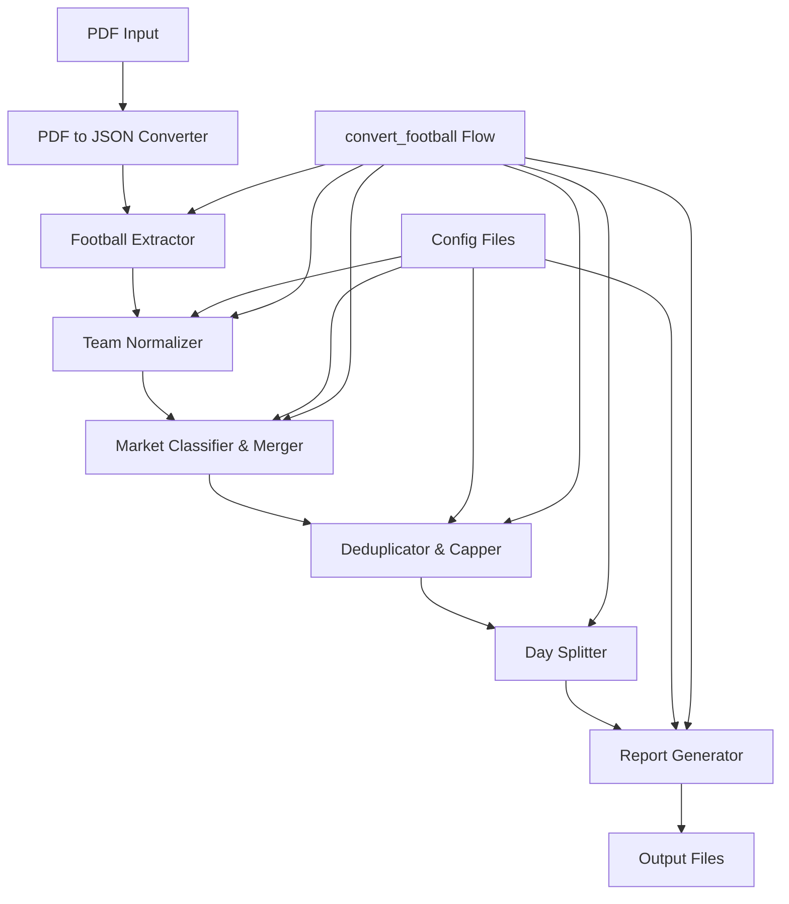
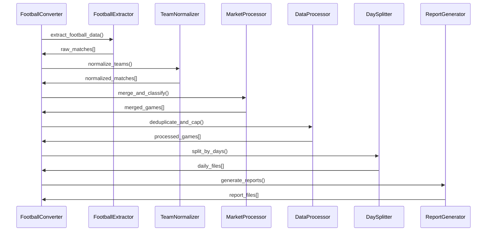

# Design Document

## Overview

This design enhances the existing football data extraction and processing system by implementing robust team normalization, improved market classification, data deduplication with priority-based capping, per-day data splitting, comprehensive reporting, and a unified conversion workflow. The solution builds upon the current `FootballExtractor` class and integrates with the existing PDF-to-JSON conversion pipeline.

The enhanced system will process football data through a multi-stage pipeline: extraction → normalization → merging → deduplication/capping → splitting → reporting. Each stage is designed to be modular, testable, and configurable.

## Architecture

### High-Level Architecture



### Component Architecture

The system consists of several key components:

1. **Enhanced FootballExtractor**: Improved extraction with better market detection
2. **TeamNormalizer**: Handles team name normalization using alias maps and heuristics
3. **MarketProcessor**: Classifies markets and handles merging logic
4. **DataProcessor**: Handles deduplication and capping with priority system
5. **DaySplitter**: Splits data by date into separate files
6. **ReportGenerator**: Creates comprehensive JSON and CSV reports
7. **FootballConverter**: High-level orchestrator for the entire pipeline

### Data Flow



## Components and Interfaces

### 1. Enhanced FootballExtractor

**Purpose**: Improved football data extraction with better market detection and team name handling.

**Key Enhancements**:

- Improved regex patterns for better team name extraction
- Enhanced market type detection
- Better handling of special characters and OCR errors
- More robust date and time parsing

**Interface**:

```python
class FootballExtractor:
    def extract_football_data(self, json_content: Dict[str, Any]) -> List[Dict[str, Any]]
    def _extract_match_data(self, line: str, league: str, date: str) -> Optional[Dict[str, Any]]
    def _is_main_1x2_market(self, match: Dict[str, Any]) -> bool
    def _extract_market_info(self, match: Dict[str, Any]) -> Dict[str, Any]
```

### 2. TeamNormalizer

**Purpose**: Normalize team names using configurable alias maps and heuristic rules.

**Configuration**: `config/team_aliases.json`

```json
{
  "aliases": {
    "Kongói Közársság": "Kongói Köztársaság",
    "Hunik Krkkó": "Hutnik Krakkó",
    "FTC": "Ferencváros"
  },
  "heuristics": {
    "remove_patterns": ["\\s+", "\\.$"],
    "replace_patterns": {
      "Közársság": "Köztársaság",
      "Krkkó": "Krakkó"
    }
  }
}
```

**Interface**:

```python
class TeamNormalizer:
    def __init__(self, config_path: str = "config/team_aliases.json")
    def normalize_team_name(self, team_name: str) -> Tuple[str, bool]
    def load_aliases(self, config_path: str) -> None
    def get_normalization_stats(self) -> Dict[str, Any]
```

### 3. MarketProcessor

**Purpose**: Classify markets, merge games, and handle market grouping logic.

**Interface**:

```python
class MarketProcessor:
    def merge_matches_by_game(self, matches: List[Dict[str, Any]]) -> List[Dict[str, Any]]
    def classify_market_type(self, match: Dict[str, Any]) -> str
    def _create_game_key(self, match: Dict[str, Any]) -> str
    def _is_main_market(self, match: Dict[str, Any]) -> bool
```

### 4. DataProcessor

**Purpose**: Handle deduplication and capping with configurable priority system.

**Configuration**: Priority system for market types

```python
MARKET_PRIORITIES = {
    "1x2": 1,
    "double_chance": 2,
    "handicap": 3,
    "total_goals": 4,
    "both_teams_score": 5,
    "half_time": 6,
    "first_last_goal": 7,
    "unknown": 10
}
```

**Interface**:

```python
class DataProcessor:
    def deduplicate_markets(self, games: List[Dict[str, Any]]) -> List[Dict[str, Any]]
    def cap_additional_markets(self, games: List[Dict[str, Any]], max_markets: int = 10) -> List[Dict[str, Any]]
    def _calculate_market_priority(self, market: Dict[str, Any]) -> int
    def get_processing_stats(self) -> Dict[str, Any]
```

### 5. DaySplitter

**Purpose**: Split processed data by date into separate files with ISO naming.

**Interface**:

```python
class DaySplitter:
    def split_by_days(self, games: List[Dict[str, Any]], output_dir: str = "jsons/days") -> Dict[str, List[str]]
    def _extract_date_from_game(self, game: Dict[str, Any]) -> Optional[str]
    def _convert_to_iso_date(self, date_str: str) -> Optional[str]
    def _save_daily_file(self, games: List[Dict[str, Any]], date: str, output_dir: str) -> str
```

### 6. ReportGenerator

**Purpose**: Generate comprehensive JSON and CSV reports with statistics and anomalies.

**Interface**:

```python
class ReportGenerator:
    def generate_reports(self, games: List[Dict[str, Any]], processing_stats: Dict[str, Any], output_dir: str = "jsons/reports") -> Dict[str, str]
    def _generate_json_report(self, data: Dict[str, Any], output_path: str) -> None
    def _generate_csv_report(self, data: Dict[str, Any], output_path: str) -> None
    def _calculate_statistics(self, games: List[Dict[str, Any]]) -> Dict[str, Any]
```

### 7. FootballConverter

**Purpose**: High-level orchestrator that coordinates the entire pipeline.

**Interface**:

```python
class FootballConverter:
    def convert_football(self, json_file_path: str, output_dir: str = "jsons") -> Dict[str, Any]
    def _run_extraction(self, json_content: Dict[str, Any]) -> List[Dict[str, Any]]
    def _run_normalization(self, matches: List[Dict[str, Any]]) -> List[Dict[str, Any]]
    def _run_merging(self, matches: List[Dict[str, Any]]) -> List[Dict[str, Any]]
    def _run_processing(self, games: List[Dict[str, Any]]) -> List[Dict[str, Any]]
    def _run_splitting(self, games: List[Dict[str, Any]]) -> Dict[str, List[str]]
    def _run_reporting(self, games: List[Dict[str, Any]], stats: Dict[str, Any]) -> Dict[str, str]
```

## Data Models

### Enhanced Game Model

```python
{
    "league": str,
    "date": str,  # Original date string
    "iso_date": str,  # ISO format date (YYYY-MM-DD)
    "time": str,
    "home_team": str,  # Normalized team name
    "away_team": str,  # Normalized team name
    "original_home_team": str,  # Original team name
    "original_away_team": str,  # Original team name
    "main_market": {
        "market_type": "1x2",
        "home_odds": float,
        "draw_odds": float,
        "away_odds": float
    },
    "additional_markets": [
        {
            "market_type": str,
            "description": str,
            "priority": int,
            "odds": {
                "home_odds": float,
                "draw_odds": Optional[float],
                "away_odds": float
            }
        }
    ],
    "total_markets": int,
    "processing_info": {
        "team_normalized": bool,
        "markets_capped": bool,
        "duplicates_removed": int
    },
    "raw_lines": List[str]
}
```

### Report Model

```python
{
    "generation_info": {
        "timestamp": str,
        "version": str,
        "input_file": str
    },
    "summary": {
        "total_games": int,
        "total_markets": int,
        "leagues_count": int,
        "dates_processed": List[str]
    },
    "processing_stats": {
        "teams_normalized": int,
        "markets_deduplicated": int,
        "markets_capped": int,
        "anomalies_detected": int
    },
    "anomalies": [
        {
            "type": str,
            "description": str,
            "game_info": Dict[str, Any],
            "severity": str
        }
    ],
    "normalization_mapping": {
        "original_name": "normalized_name"
    },
    "daily_breakdown": {
        "date": {
            "games_count": int,
            "markets_count": int,
            "leagues": List[str]
        }
    }
}
```

## Error Handling

### Error Categories

1. **Configuration Errors**: Missing or invalid configuration files
2. **Data Quality Errors**: Unparseable dates, malformed team names
3. **Processing Errors**: Failed normalization, market classification issues
4. **File System Errors**: Unable to create directories or write files

### Error Handling Strategy

```python
class FootballProcessingError(Exception):
    """Base exception for football processing errors"""
    pass

class ConfigurationError(FootballProcessingError):
    """Configuration-related errors"""
    pass

class DataQualityError(FootballProcessingError):
    """Data quality issues"""
    pass

class ProcessingError(FootballProcessingError):
    """Processing pipeline errors"""
    pass
```

### Graceful Degradation

- If team normalization fails, use original team names and log anomaly
- If market classification fails, mark as "unknown" type
- If date parsing fails, place in "undated" category
- Continue processing even if individual games fail

## Testing Strategy

### Unit Testing Approach

1. **Component Testing**: Each component tested in isolation
2. **Integration Testing**: Test component interactions
3. **End-to-End Testing**: Full pipeline testing with sample data
4. **Configuration Testing**: Test various configuration scenarios

### Test Data Strategy

```python
# Sample test data structure
TEST_MATCHES = [
    {
        "league": "Premier League",
        "date": "2025. augusztus 5.",
        "time": "K 20:00",
        "home_team": "Kongói Közársság",  # Needs normalization
        "away_team": "Szudán",
        "home_odds": 3.35,
        "draw_odds": 2.74,
        "away_odds": 2.24,
        "raw_line": "K 20:00 65110 Kongói Közársság - Szudán 3,35 2,74 2,24"
    }
]
```

### Test Coverage Requirements

- **Unit Tests**: 90% code coverage minimum
- **Integration Tests**: Cover all component interactions
- **Edge Cases**: Handle malformed data, missing configurations
- **Performance Tests**: Ensure processing speed for large datasets

### Mock Strategy

- Mock file system operations for testing
- Mock configuration loading
- Create test fixtures for various data scenarios
- Use dependency injection for testability

## Performance Considerations

### Optimization Strategies

1. **Lazy Loading**: Load configurations only when needed
2. **Caching**: Cache normalized team names and market classifications
3. **Batch Processing**: Process games in batches for large datasets
4. **Memory Management**: Stream processing for very large files

### Scalability

- Design for processing thousands of games per day
- Efficient regex compilation and reuse
- Minimize file I/O operations
- Use generators for memory-efficient processing

### Monitoring

- Track processing times for each pipeline stage
- Monitor memory usage during processing
- Log performance metrics in reports
- Alert on processing anomalies or failures
