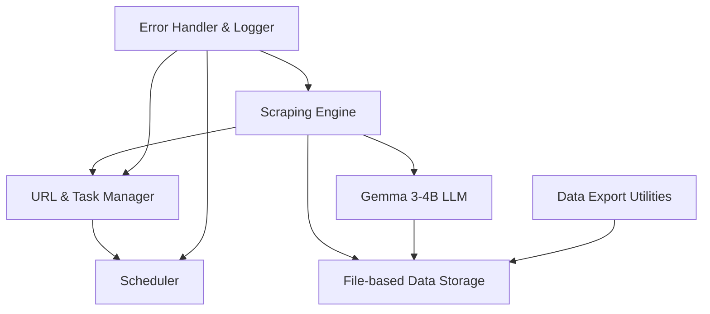

# Design Document: Intelligent Football Scraper System

## Overview

The Intelligent Football Scraper System is designed to collect, process, and analyze football data from Flashscore.com using a combination of web scraping technologies and local AI processing with the Gemma 3-4B model. The system follows a modular architecture to ensure scalability, maintainability, and resilience.

This design document outlines the technical architecture, components, data models, and integration points for the system, with a focus on combining web scraping capabilities with local LLM processing to create an intelligent football data platform.

## Architecture

The system follows a microservices-based architecture with the following key components:



### Core Components

1. **Scraping Engine**
   - Responsible for browser automation and content extraction
   - Handles JavaScript rendering and dynamic content
   - Implements intelligent parsing strategies for different page types

2. **URL & Task Manager**
   - Queue-based system for managing scraping tasks
   - Prioritizes tasks based on urgency (live matches > upcoming > historical)
   - Tracks task status and handles retries

3. **Scheduler**
   - Orchestrates recurring tasks at predefined intervals
   - Manages resource allocation to prevent overloading
   - Adapts scheduling based on system load and priority

4. **Data Storage**
   - Structured database with normalized schema
   - Separate storage for raw and AI-processed data
   - Efficient indexing for quick retrieval

5. **Error Handler & Logger**
   - Comprehensive logging system
   - Implements retry logic with exponential backoff
   - Alerts for critical failures

6. **Gemma 3-4B LLM Integration**
   - Local AI processing of football data
   - Inference optimization for resource efficiency
   - Task queuing for batch processing

7. **Data Export Utilities**
   - Export data in various formats
   - Apply transformations during export
   - Ensure data integrity during export operations

## Components and Interfaces

### 1. Scraping Engine

#### Technologies
- **Primary Browser Automation**: Playwright (latest version)
- **HTTP Client**: Axios for direct API requests
- **HTML Parsing**: Cheerio for static content

#### Key Interfaces
```typescript
interface ScraperInterface {
  initialize(): Promise<void>;
  navigateTo(url: string): Promise<void>;
  extractData(selectors: SelectorMap): Promise<ScrapedData>;
  handleDynamicContent(strategy: LoadingStrategy): Promise<void>;
  close(): Promise<void>;
}

interface ApiScraperInterface {
  fetchData(url: string, params?: Record<string, any>): Promise<any>;
  interceptNetworkRequests(page: Page, patterns: string[]): Promise<NetworkRequest[]>;
  parseApiResponse(data: any, schema: ApiResponseSchema): ScrapedData;
}

interface SelectorMap {
  [key: string]: string | SelectorMap;
}

interface ScrapedData {
  [key: string]: any;
  metadata: {
    timestamp: Date;
    source: string;
    success: boolean;
  }
}

interface NetworkRequest {
  url: string;
  method: string;
  postData?: string;
  response?: any;
}

interface ApiResponseSchema {
  [key: string]: string | ApiResponseSchema;
}
```

#### Responsibilities
- Browser automation and navigation with Playwright
- Direct API requests with Axios when possible
- Network request interception for API endpoint discovery
- Handling of JavaScript-rendered content
- Extraction of structured data
- Management of cookies and popups
- Intelligent handling of rate limiting

### 2. URL & Task Manager

#### Technologies
- **Queue System**: In-memory queue with file-based persistence
- **State Management**: JSON files

#### Key Interfaces
```typescript
interface TaskManager {
  addTask(task: ScrapingTask): Promise<string>;
  getNextTask(): Promise<ScrapingTask | null>;
  updateTaskStatus(taskId: string, status: TaskStatus): Promise<void>;
  retryFailedTasks(): Promise<void>;
  persistTasks(): Promise<void>;
  loadTasks(): Promise<void>;
}

interface ScrapingTask {
  id: string;
  url: string;
  priority: TaskPriority;
  type: TaskType;
  metadata: Record<string, any>;
  retryCount: number;
  status: TaskStatus;
  createdAt: Date;
  updatedAt: Date;
}

enum TaskPriority {
  HIGH, // Live matches
  MEDIUM, // Upcoming matches
  LOW, // Historical data
}

enum TaskType {
  LIVE_MATCH,
  UPCOMING_MATCH,
  HISTORICAL_MATCH,
  LEAGUE_DISCOVERY,
}

enum TaskStatus {
  PENDING,
  IN_PROGRESS,
  COMPLETED,
  FAILED,
  RETRY,
}
```

#### Responsibilities
- Management of scraping task queue in memory
- File-based persistence for task state
- Task prioritization and scheduling
- Tracking of task status and history
- Implementation of retry logic with exponential backoff

### 3. Scheduler

#### Technologies
- **Scheduler**: node-cron (latest version)
- **State Management**: JSON files

#### Key Interfaces
```typescript
interface Scheduler {
  scheduleTask(cronExpression: string, task: () => Promise<void>): string;
  cancelTask(taskId: string): boolean;
  pauseAllTasks(): void;
  resumeAllTasks(): void;
  getTaskStatus(taskId: string): SchedulerTaskStatus;
  persistSchedule(): Promise<void>;
  loadSchedule(): Promise<void>;
}

interface SchedulerTaskStatus {
  id: string;
  cronExpression: string;
  nextRunTime: Date;
  lastRunTime?: Date;
  lastRunStatus?: 'success' | 'failure';
  isActive: boolean;
}
```

#### Responsibilities
- Scheduling of recurring scraping tasks
- Management of task execution timing
- Adaptation of schedules based on system load
- Coordination with the Task Manager
- File-based persistence of scheduling configuration

### 4. Data Storage

#### Technologies
- **File System**: JSON files in structured directories
- **Indexing**: In-memory indexes with file-based persistence
- **Caching**: LRU cache for frequently accessed data

#### Key Interfaces
```typescript
interface DataStorage {
  saveMatch(match: Match): Promise<string>;
  saveMatchEvents(events: MatchEvent[]): Promise<void>;
  saveMatchStats(stats: MatchStat[]): Promise<void>;
  getMatch(matchId: string): Promise<Match | null>;
  queryMatches(filter: MatchFilter): Promise<Match[]>;
  saveAIAnalysis(analysis: AIAnalysis): Promise<void>;
  buildIndexes(): Promise<void>;
  exportData(format: ExportFormat, filter?: ExportFilter): Promise<string>;
}

interface MatchFilter {
  leagueId?: string;
  teamId?: string;
  dateFrom?: Date;
  dateTo?: Date;
  status?: MatchStatus;
  limit?: number;
  offset?: number;
}

enum ExportFormat {
  JSON,
  CSV,
  JSONL
}

interface ExportFilter {
  dataType: DataType;
  filter: Record<string, any>;
  transformations?: DataTransformation[];
}

enum DataType {
  MATCHES,
  EVENTS,
  STATS,
  LEAGUES,
  TEAMS,
  AI_ANALYSIS
}

interface DataTransformation {
  type: TransformationType;
  config: Record<string, any>;
}

enum TransformationType {
  FILTER,
  SORT,
  AGGREGATE,
  JOIN,
  PROJECT
}
```

#### Responsibilities
- Storage of structured football data in JSON files
- Directory organization by data type and time periods
- Efficient querying through in-memory indexes
- File-based data relationships
- Backup and versioning of data files
- Data export in multiple formats

### 5. Error Handler & Logger

#### Technologies
- **Logging**: Winston (latest version)
- **File Rotation**: winston-daily-rotate-file
- **Console Formatting**: chalk for colorized output

#### Key Interfaces
```typescript
interface ErrorHandler {
  logError(error: Error, context: ErrorContext): void;
  handleScrapingError(error: Error, task: ScrapingTask): Promise<void>;
  handleSystemError(error: Error, component: SystemComponent): void;
  sendAlert(severity: AlertSeverity, message: string): Promise<void>;
}

interface Logger {
  info(message: string, metadata?: Record<string, any>): void;
  warn(message: string, metadata?: Record<string, any>): void;
  error(message: string, error?: Error, metadata?: Record<string, any>): void;
  debug(message: string, metadata?: Record<string, any>): void;
  profile(operation: string): void;
}

interface ErrorContext {
  component: string;
  operation: string;
  timestamp: Date;
  metadata: Record<string, any>;
}

enum AlertSeverity {
  INFO,
  WARNING,
  ERROR,
  CRITICAL,
}

enum SystemComponent {
  SCRAPER,
  TASK_MANAGER,
  SCHEDULER,
  DATA_STORAGE,
  AI_PROCESSOR,
}
```

#### Responsibilities
- Comprehensive error logging to files
- Log rotation and archiving
- Colorized console output for development
- Implementation of retry strategies
- Console-based alerting for critical failures
- Performance monitoring and profiling

### 6. Gemma 3-4B LLM Integration

#### Technologies
- **LLM Framework**: @gemma/nodejs (latest version)
- **Optimization**: ONNX Runtime for efficient inference
- **Memory Management**: Garbage collection optimization

#### Key Interfaces
```typescript
interface LLMProcessor {
  initialize(): Promise<void>;
  processMatchData(match: Match): Promise<AIAnalysis>;
  generateInsights(matches: Match[]): Promise<TeamInsight[]>;
  detectAnomalies(match: Match): Promise<Anomaly[]>;
  shutdown(): Promise<void>;
  saveToFile(analysis: AIAnalysis): Promise<void>;
  loadFromFile(matchId: string): Promise<AIAnalysis | null>;
}

interface AIAnalysis {
  matchId: string;
  keyEvents: KeyEvent[];
  performanceMetrics: PerformanceMetric[];
  narrativeSummary: string;
  predictions: Prediction[];
  confidence: number;
  processingTime: number;
  createdAt: Date;
}

interface KeyEvent {
  minute: number;
  description: string;
  importance: number;
  relatedPlayers: string[];
}

interface PerformanceMetric {
  team: string;
  metric: string;
  value: number;
  interpretation: string;
}

interface Prediction {
  type: PredictionType;
  description: string;
  confidence: number;
}

interface TaskQueue {
  addTask(task: AITask): Promise<string>;
  getNextTask(): Promise<AITask | null>;
  updateTaskStatus(taskId: string, status: AITaskStatus): Promise<void>;
  persistQueue(): Promise<void>;
  loadQueue(): Promise<void>;
}

interface AITask {
  id: string;
  type: AITaskType;
  data: any;
  priority: number;
  status: AITaskStatus;
  createdAt: Date;
  updatedAt: Date;
}

enum AITaskType {
  MATCH_ANALYSIS,
  TEAM_INSIGHTS,
  ANOMALY_DETECTION,
  NARRATIVE_GENERATION
}

enum AITaskStatus {
  PENDING,
  IN_PROGRESS,
  COMPLETED,
  FAILED
}

enum PredictionType {
  NEXT_GOAL,
  FINAL_SCORE,
  PLAYER_PERFORMANCE,
  TEAM_STRATEGY,
}
```

#### Responsibilities
- Local processing of football data using Gemma 3-4B
- Efficient model loading and resource management
- File-based storage of AI analysis results
- Batch processing through file-based task queue
- Extraction of insights and patterns from match data
- Generation of match narratives and summaries
- Anomaly detection in match data
- Performance optimization for inference on limited resources

### 7. Data Export Utilities

#### Technologies
- **File System**: Node.js fs/promises
- **Format Conversion**: json2csv, jsonl-stringify
- **Compression**: zlib

#### Key Interfaces
```typescript
interface DataExporter {
  exportToJSON(data: any, filePath: string, options?: ExportOptions): Promise<void>;
  exportToCSV(data: any[], filePath: string, options?: CSVExportOptions): Promise<void>;
  exportToJSONL(data: any[], filePath: string, options?: ExportOptions): Promise<void>;
  compressExport(filePath: string, format: CompressionFormat): Promise<string>;
}

interface ExportOptions {
  pretty?: boolean;
  includeMetadata?: boolean;
  transformations?: DataTransformation[];
}

interface CSVExportOptions extends ExportOptions {
  fields?: string[];
  header?: boolean;
}

enum CompressionFormat {
  GZIP,
  ZIP
}
```

#### Responsibilities
- Export data in various formats (JSON, CSV, JSONL)
- Apply transformations during export
- Compress exported files for efficient storage
- Maintain consistent file naming conventions
- Ensure data integrity during export operations

## Data Models

### Core Data Models

#### Match
```typescript
interface Match {
  id: string;
  leagueId: string;
  homeTeam: Team;
  awayTeam: Team;
  startTime: Date;
  status: MatchStatus;
  scores: {
    homeScore: number;
    awayScore: number;
    halfTimeHome?: number;
    halfTimeAway?: number;
  };
  venue?: string;
  referee?: string;
  flashscoreUrl: string;
  createdAt: Date;
  updatedAt: Date;
}

enum MatchStatus {
  SCHEDULED,
  LIVE,
  HALFTIME,
  FINISHED,
  POSTPONED,
  CANCELED,
}
```

#### Team
```typescript
interface Team {
  id: string;
  name: string;
  country: string;
  logo?: string;
}
```

#### League
```typescript
interface League {
  id: string;
  name: string;
  country: string;
  season: string;
  type: LeagueType;
  flashscoreUrl: string;
}

enum LeagueType {
  LEAGUE,
  CUP,
  INTERNATIONAL,
}
```

#### MatchEvent
```typescript
interface MatchEvent {
  id: string;
  matchId: string;
  minute: number;
  eventType: EventType;
  team: string;
  player?: string;
  assistBy?: string;
  description?: string;
}

enum EventType {
  GOAL,
  OWN_GOAL,
  PENALTY_GOAL,
  MISSED_PENALTY,
  YELLOW_CARD,
  RED_CARD,
  SUBSTITUTION,
  VAR_DECISION,
}
```

#### MatchStat
```typescript
interface MatchStat {
  id: string;
  matchId: string;
  statType: StatType;
  homeValue: string | number;
  awayValue: string | number;
}

enum StatType {
  POSSESSION,
  SHOTS_ON_TARGET,
  SHOTS_OFF_TARGET,
  CORNERS,
  FOULS,
  YELLOW_CARDS,
  RED_CARDS,
  OFFSIDES,
}
```

### AI-Enhanced Data Models

#### AIAnalysis
```typescript
interface AIAnalysis {
  id: string;
  matchId: string;
  keyInsights: string[];
  narrativeSummary: string;
  teamPerformance: {
    home: PerformanceAnalysis;
    away: PerformanceAnalysis;
  };
  keyPlayerPerformances: PlayerPerformance[];
  tacticalAnalysis: string;
  anomalies: Anomaly[];
  createdAt: Date;
}

interface PerformanceAnalysis {
  teamId: string;
  overallRating: number;
  strengths: string[];
  weaknesses: string[];
  keyStats: Record<string, number>;
}

interface PlayerPerformance {
  playerName: string;
  teamId: string;
  rating: number;
  keyContributions: string[];
}

interface Anomaly {
  description: string;
  confidence: number;
  relatedData: string;
}
```

## Error Handling

The system implements a comprehensive error handling strategy:

1. **Categorized Errors**
   - Network errors (connection issues, timeouts)
   - Parsing errors (DOM structure changes)
   - Data validation errors
   - System resource errors
   - AI processing errors

2. **Retry Strategies**
   - Exponential backoff for transient errors
   - Circuit breaker pattern for persistent failures
   - Fallback mechanisms for critical operations

3. **Graceful Degradation**
   - Continue operation with reduced functionality
   - Prioritize critical data collection
   - Queue AI processing for later if resources are constrained

4. **Monitoring and Alerting**
   - Real-time error dashboards
   - Configurable alert thresholds
   - Detailed error logs with context

## Testing Strategy

The testing strategy covers multiple levels to ensure system reliability:

1. **Unit Testing**
   - Component-level tests with mocked dependencies
   - Coverage targets for critical code paths
   - Automated test execution in CI/CD pipeline

2. **Integration Testing**
   - Tests for component interactions
   - Database integration tests
   - Message queue integration tests
   - LLM integration tests with sample data

3. **End-to-End Testing**
   - Simulated scraping scenarios
   - Full data processing pipeline tests
   - API endpoint testing

4. **Performance Testing**
   - Load testing for concurrent scraping tasks
   - Stress testing for AI processing capacity
   - Database query performance benchmarks

5. **Resilience Testing**
   - Chaos engineering principles
   - Simulated component failures
   - Network partition scenarios

## Deployment and Scaling

The system is designed for flexible deployment options:

1. **Local Development**
   - Docker Compose setup for local development
   - Mock services for external dependencies

2. **Production Deployment**
   - Containerized microservices
   - Kubernetes orchestration
   - Horizontal scaling for high-load components

3. **Resource Optimization**
   - Efficient scheduling of resource-intensive tasks
   - Batch processing for AI operations
   - Caching strategies for frequently accessed data

4. **Monitoring and Observability**
   - Prometheus metrics collection
   - Grafana dashboards
   - Distributed tracing with Jaeger

## Security Considerations

1. **Data Protection**
   - Encryption of sensitive configuration
   - Secure storage of API keys and credentials
   - Regular security audits

2. **Access Control**
   - Role-based access to API endpoints
   - Authentication for all external interfaces
   - Rate limiting to prevent abuse

3. **Ethical Scraping**
   - Respect for robots.txt directives
   - Rate limiting to avoid server impact
   - Proper identification via User-Agent headers

4. **AI Model Security**
   - Secure model storage and loading
   - Input validation to prevent prompt injection
   - Output sanitization

## Future Enhancements

1. **Advanced AI Features**
   - Fine-tuning Gemma model on football-specific data
   - Predictive analytics for match outcomes
   - Natural language generation for match reports

2. **Expanded Data Sources**
   - Integration with additional football data providers
   - Official API partnerships where available
   - User-contributed data validation

3. **Enhanced Visualization**
   - Interactive dashboards for data exploration
   - Real-time match visualization
   - Historical trend analysis tools

4. **API Ecosystem**
   - Developer SDK for multiple languages
   - Webhook integration for real-time events
   - GraphQL API for flexible data querying