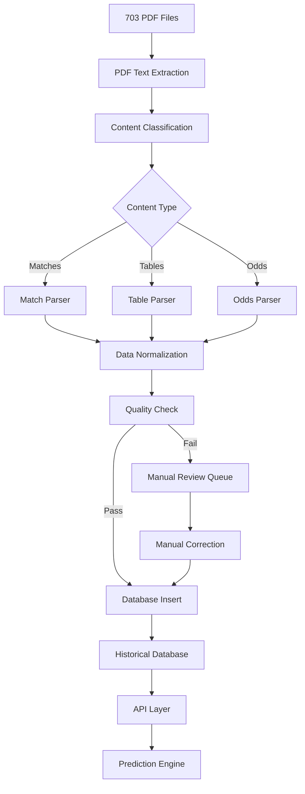

# 📋 TÖRTÉNELMI ADATOK FELDOLGOZÁSI TERV

## SzerencseMix PDF Archive → Strukturált Adatbázis

**Utolsó frissítés:** 2025-06-28
**Státusz:** Tervezési fázis
**Cél:** 703 PDF fájlból strukturált, gépileg feldolgozható adatbázis építése

---

## 🎯 1. CÉLKITŰZÉSEK

### Elsődleges célok

1. **Múltbeli meccsek teljes adatbázisa** (2019-2025)
2. **Jövőbeli meccsek listája** (aktuális/jövő időszak)
3. **Liga táblázatok történelmi adatai**
4. **Gyors, optimalizált lekérdezési rendszer**
5. **Manuális kiegészítés/javítás lehetősége**

### Sikerkritériumok

- ✅ 95%+ automatikus adatkinyerési pontosság
- ✅ < 1 másodperc átlagos lekérdezési idő
- ✅ Komplett adattisztítás és normalizálás
- ✅ Skálázható architektúra jövőbeli bővítéshez

---

## 🗂️ 2. ADATSTRUKTÚRA TERVEZÉS

### 2.1 Fő adatkategóriák

#### A) MECCS ADATOK

```sql
-- Múltbeli meccsek (eredményekkel)
historical_matches:
  - match_id (PRIMARY KEY)
  - date (DATE)
  - time (TIME)
  - home_team (VARCHAR)
  - away_team (VARCHAR)
  - league/competition (VARCHAR)
  - home_score (INT)
  - away_score (INT)
  - match_status (completed/cancelled/postponed)
  - round/matchday (INT)
  - season (VARCHAR: "2024/25")
  - source_pdf (VARCHAR)
  - extraction_confidence (FLOAT 0-1)
  - manual_verified (BOOLEAN)

-- Jövőbeli meccsek (eredmények nélkül)
future_matches:
  - match_id (PRIMARY KEY)
  - date (DATE)
  - time (TIME)
  - home_team (VARCHAR)
  - away_team (VARCHAR)
  - league/competition (VARCHAR)
  - round/matchday (INT)
  - season (VARCHAR)
  - betting_odds (JSON: {"1": 2.5, "X": 3.2, "2": 2.8})
  - source_pdf (VARCHAR)
  - extraction_confidence (FLOAT)
  - prediction_generated (BOOLEAN)
```

#### B) CSAPAT ADATOK

```sql
teams:
  - team_id (PRIMARY KEY)
  - team_name (VARCHAR)
  - normalized_name (VARCHAR) -- egységesített név
  - alternative_names (JSON) -- összes variáció
  - country (VARCHAR)
  - league_tier (INT: 1=első osztály)
  - active_since (DATE)
  - last_seen (DATE)

team_statistics:
  - stat_id (PRIMARY KEY)
  - team_id (FOREIGN KEY)
  - season (VARCHAR)
  - league (VARCHAR)
  - matches_played (INT)
  - wins (INT)
  - draws (INT)
  - losses (INT)
  - goals_for (INT)
  - goals_against (INT)
  - points (INT)
  - position (INT)
  - form_last_5 (VARCHAR: "WDLWW")
```

#### C) LIGA TÁBLÁZATOK

```sql
league_tables:
  - table_id (PRIMARY KEY)
  - league (VARCHAR)
  - season (VARCHAR)
  - matchday (INT)
  - snapshot_date (DATE)
  - team_id (FOREIGN KEY)
  - position (INT)
  - points (INT)
  - matches_played (INT)
  - wins (INT)
  - draws (INT)
  - losses (INT)
  - goals_for (INT)
  - goals_against (INT)
  - goal_difference (INT)
  - source_pdf (VARCHAR)
```

#### D) FOGADÁSI ADATOK

```sql
betting_odds:
  - odds_id (PRIMARY KEY)
  - match_id (FOREIGN KEY)
  - bet_type (VARCHAR: "1X2", "Over/Under", "Both Teams Score")
  - odds_1 (DECIMAL)
  - odds_x (DECIMAL)
  - odds_2 (DECIMAL)
  - bookmaker (VARCHAR: "SzerencseMix")
  - timestamp (DATETIME)
```

### 2.2 Adatbázis architektúra

```
sport-prediction/
├── data/
│   ├── database/
│   │   ├── historical_football.db (SQLite fő adatbázis)
│   │   ├── raw_extractions.db (nyers PDF kivonat)
│   │   └── processed_data.db (tisztított adatok)
│   ├── szerencsemix_archive/ (PDF archívum)
│   ├── exports/ (CSV/JSON exportok)
│   └── manual_corrections/ (kézi javítások)
├── src/
│   ├── data_extraction/ (PDF feldolgozás)
│   ├── data_processing/ (tisztítás, normalizálás)
│   ├── database/ (DB műveletek)
│   └── api/ (lekérdezési interfész)
└── config/
    ├── team_mappings.json (csapatnév normalizálás)
    ├── league_mappings.json (bajnokság normalizálás)
    └── extraction_rules.json (kinyerési szabályok)
```

---

## 🔧 3. TECHNOLÓGIAI STACK

### 3.1 Adatbázis réteg

- **SQLite** (fő adatbázis) - gyors, fájl alapú, lekérdezésoptimalizált
- **JSON mezők** komplex adatokhoz (odds, alternative_names)
- **Indexek** gyakori lekérdezésekhez (date, team, league)
- **Views** összefoglaló táblákhoz

### 3.2 Feldolgozó réteg

```python
# Főbb modulok:
├── PDFExtractor - PDF szöveg kinyerés
├── MatchParser - meccs adatok felismerése
├── TableParser - liga táblázat felismerése
├── DataNormalizer - adattisztítás
├── TeamMatcher - csapatnév egységesítés
├── LeagueMatcher - bajnokság egységesítés
└── QualityController - adatminőség ellenőrzés
```

### 3.3 API réteg

```python
# Lekérdezési interfészek:
├── HistoricalAPI - múltbeli meccsek
├── TeamAPI - csapat statisztikák
├── LeagueAPI - liga táblázatok
├── PredictionAPI - predikciók generálása
└── ManualAPI - kézi javítások
```

---

## 📊 4. FELDOLGOZÁSI FOLYAMAT

### 4.1 Fázisok és timeline

#### FÁZIS 1: Alapinfrastruktúra (1-2 hét)

- [x] PDF archívum rendszerezés
- [ ] Adatbázis séma létrehozás
- [ ] Alapvető PDF extractor
- [ ] Konfigurációs fájlok (team/league mappings)
- [ ] Logging és hibakezelés

#### FÁZIS 2: Adatkinyerés (2-3 hét)

- [ ] Meccs adatok felismerése (regex + ML)
- [ ] Liga táblázat felismerése
- [ ] Fogadási odds kinyerése
- [ ] Batch feldolgozás 703 PDF-re
- [ ] Nyers adatok validálása

#### FÁZIS 3: Adattisztítás (1-2 hét)

- [ ] Csapatnév normalizálás
- [ ] Bajnokság/liga egységesítés
- [ ] Duplikátum szűrés
- [ ] Hiányzó adatok pótlása
- [ ] Minőségi metrikák

#### FÁZIS 4: Optimalizálás (1 hét)

- [ ] Adatbázis indexek optimalizálás
- [ ] Lekérdezési teljesítmény tesztelés
- [ ] Cache mechanizmus
- [ ] API endpoint-ok

#### FÁZIS 5: Manuális felülvizsgálat (ongoing)

- [ ] Hibás rekordok azonosítása
- [ ] Kézi javítási workflow
- [ ] Adatminőség monitoring
- [ ] Folyamatos karbantartás

### 4.2 Feldolgozási pipeline



---

## 🎛️ 5. ADATMINŐSÉG ÉS VALIDÁCIÓ

### 5.1 Automatikus validáció

```python
# Validációs szabályok:
date_validation:
  - Dátum formátum: YYYY-MM-DD
  - Logikus időrend (múlt vs jövő)
  - Hétvége/hétköznap konzisztencia

team_validation:
  - Csapatnév hossz: 3-50 karakter
  - Speciális karakterek szűrése
  - Ismert csapatok adatbázisa

score_validation:
  - Eredmény: 0-20 közötti egész számok
  - Logikus eredmények (nem 50-0)
  - Consistency checks

league_validation:
  - Ismert bajnokságok listája
  - Szezon formátum validáció
  - Csapat-liga összeférhetőség
```

### 5.2 Confidence scoring

```python
# Megbízhatósági pontszám 0-1 skálán:
extraction_confidence = (
    text_quality_score * 0.3 +      # OCR minőség
    pattern_match_score * 0.4 +     # Regex találatok
    context_validation_score * 0.3   # Kontextus validáció
)

# Küszöbértékek:
# 0.9-1.0: Automatikus feldolgozás
# 0.7-0.9: Gyors manuális ellenőrzés
# 0.0-0.7: Teljes manuális felülvizsgálat
```

---

## 🔍 6. NORMALIZÁLÁS ÉS MAPPING

### 6.1 Csapatnév normalizálás

```json
{
  "team_mappings": {
    "Manchester United": {
      "canonical_name": "Manchester United",
      "aliases": ["Man United", "Man Utd", "MUFC", "Manchester U."],
      "country": "England",
      "league": "Premier League"
    },
    "Real Madrid": {
      "canonical_name": "Real Madrid",
      "aliases": ["Real Madrid CF", "Real", "RM"],
      "country": "Spain",
      "league": "La Liga"
    }
  }
}
```

### 6.2 Liga normalizálás

```json
{
  "league_mappings": {
    "Premier League": {
      "canonical_name": "Premier League",
      "aliases": ["EPL", "English Premier League", "Premiere League"],
      "country": "England",
      "tier": 1,
      "season_format": "YYYY/YY"
    },
    "Champions League": {
      "canonical_name": "UEFA Champions League",
      "aliases": ["UCL", "CL", "Champions", "BL"],
      "country": "International",
      "tier": 0,
      "season_format": "YYYY/YY"
    }
  }
}
```

---

## 🚀 7. IMPLEMENTÁCIÓS STRATÉGIA

### 7.1 Fejlesztési megközelítés

1. **Incremental processing**: Kezdés kis mintával (50 PDF)
2. **Test-driven development**: Unit tesztek minden modulhoz
3. **Data versioning**: Git-like verziókezelés az adatokhoz
4. **Rollback capability**: Hibás feldolgozás visszavonása
5. **Progress tracking**: Real-time előrehaladás monitoring

### 7.2 Hibahelytállás

```python
# Hibakezelési stratégia:
try:
    result = process_pdf(pdf_path)
except ExtractionError as e:
    log_error(pdf_path, e)
    add_to_manual_queue(pdf_path, error_type="extraction")
except ValidationError as e:
    log_error(pdf_path, e)
    add_to_manual_queue(pdf_path, error_type="validation")
except Exception as e:
    log_critical_error(pdf_path, e)
    notify_admin(e)
```

### 7.3 Teljesítmény optimalizálás

- **Batch processing**: 50 PDF egyszerre
- **Multiprocessing**: CPU magok kihasználása
- **Database bulk insert**: Gyors adatbetöltés
- **Caching**: Gyakran használt lookupok
- **Lazy loading**: Adatok igény szerinti betöltése

---

## 🛡️ 8. ADATBIZTONSÁG ÉS BACKUP

### 8.1 Backup stratégia

```bash
# Automatikus backup pipeline:
daily_backup:
  - SQLite dump → compressed backup
  - Config files backup
  - Manual corrections backup
  - Cloud sync (optional)

weekly_backup:
  - Full data export (CSV/JSON)
  - Schema backup
  - Processing logs archive

monthly_backup:
  - PDF archive verification
  - Data integrity checks
  - Performance metrics export
```

### 8.2 Verziókezelés

```python
# Adatverziókezelés:
data_versions:
  - v1.0: Initial extraction (2025-06-28)
  - v1.1: Manual corrections batch 1
  - v1.2: Team name normalization updates
  - v2.0: Additional PDF integration

schema_versions:
  - v1.0: Base schema
  - v1.1: Added confidence scores
  - v1.2: Extended betting odds
```

---

## 📈 9. MONITORING ÉS METRIKÁK

### 9.1 Kulcs teljesítménymutatók (KPI)

```python
extraction_metrics = {
    "total_pdfs_processed": 703,
    "successful_extractions": 0,
    "failed_extractions": 0,
    "manual_review_needed": 0,
    "processing_time_avg": 0,
    "extraction_confidence_avg": 0,
    "data_quality_score": 0
}

data_metrics = {
    "total_matches_extracted": 0,
    "historical_matches": 0,
    "future_matches": 0,
    "unique_teams": 0,
    "unique_leagues": 0,
    "table_snapshots": 0
}
```

### 9.2 Minőségi jelentések

```python
# Automatikus jelentések:
daily_report:
  - Feldolgozott fájlok száma
  - Új hibák és figyelmeztetések
  - Adatminőségi metrikák
  - Rendszer teljesítmény

weekly_report:
  - Teljesítmény trendek
  - Adatbázis növekedés
  - Manuális javítások statisztikája
  - Predikciós pontosság (később)
```

---

## 🎯 10. JÖVŐBELI KITERJESZTÉSEK

### 10.1 Rövid távú (3-6 hónap)

- [ ] Real-time PDF processing (új fájlok automatikus feldolgozása)
- [ ] Web dashboard adatok megtekintéséhez
- [ ] Advanced ML modellek a kinyeréshez
- [ ] Multiple bookmaker odds integration

### 10.2 Hosszú távú (6-12 hónap)

- [ ] Live API integráció (real-time odds)
- [ ] Player statistics extraction
- [ ] Weather data integration
- [ ] Advanced prediction algorithms
- [ ] Mobile app interface

---

## 📋 11. KÖVETKEZŐ LÉPÉSEK

### Azonnali teendők

1. ✅ **Tervezési dokumentum elkészítése** ← KÉSZ
2. 🔄 **Adatbázis séma finalizálása és létrehozása**
3. 🔄 **PDF extraction alapmodul fejlesztése**
4. 🔄 **Team/league mapping fájlok készítése**
5. 🔄 **Első batch teszt 10 PDF-fel**

### Heti célok

- **1. hét**: Adatbázis séma + alapinfrastruktúra
- **2. hét**: PDF parser fejlesztése
- **3. hét**: Adattisztítás és normalizálás
- **4. hét**: Teljes pipeline tesztelése

---

**📞 Kommunikáció:** Ez a terv élő dokumentum, folyamatosan frissítjük az implementáció során.

**🎯 Cél:** Robusztus, skálázható rendszer építése, amely képes kezelni a hatalmas adatmennyiséget és precíz predikciókhoz szolgáltat alapot.
