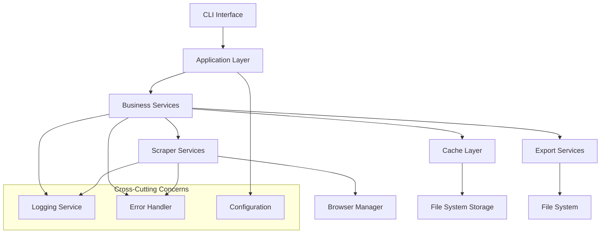

# Design Document

## Overview

This design document outlines the architectural improvements for the Flashscore scraper project. The current project is a functional TypeScript web scraper but lacks proper type safety, error handling, caching mechanisms, and optimal code organization. The redesign focuses on creating a robust, maintainable, and extensible scraping system with enterprise-grade reliability.

The improved architecture will implement a layered approach with clear separation of concerns: presentation layer (CLI), business logic layer (services), data access layer (repositories), and infrastructure layer (caching, logging, error handling).

## Architecture

### High-Level Architecture



### Layered Architecture

1. **Presentation Layer**: CLI interface with argument parsing and interactive prompts
2. **Application Layer**: Orchestrates business operations and manages application flow
3. **Business Layer**: Core scraping logic, data processing, and business rules
4. **Data Layer**: Caching, file operations, and data persistence
5. **Infrastructure Layer**: Browser management, logging, error handling, and configuration

## Components and Interfaces

### Core Interfaces

```typescript
// Browser Management
interface IBrowserManager {
  launch(options?: BrowserOptions): Promise<Browser>;
  createPage(browser: Browser): Promise<Page>;
  closePage(page: Page): Promise<void>;
  closeBrowser(browser: Browser): Promise<void>;
  restart(): Promise<Browser>;
}

// Scraping Services
interface IScrapingService<T> {
  scrape(url: string, options?: ScrapingOptions): Promise<T>;
  validate(data: T): boolean;
  transform(data: any): T;
}

// Caching
interface ICacheService {
  get<T>(key: string): Promise<T | null>;
  set<T>(key: string, value: T, ttl?: number): Promise<void>;
  has(key: string): Promise<boolean>;
  delete(key: string): Promise<void>;
  clear(): Promise<void>;
}

// Error Handling
interface IErrorHandler {
  handle(error: Error, context: ErrorContext): Promise<void>;
  retry<T>(operation: () => Promise<T>, options: RetryOptions): Promise<T>;
}

// Export Services
interface IExportService {
  export(data: any, format: ExportFormat, options: ExportOptions): Promise<string>;
  validate(data: any): ValidationResult;
}
```

### Component Structure

#### 1. Browser Manager (`src/core/browser/`)
- **BrowserManager**: Manages browser lifecycle with auto-restart capabilities
- **PagePool**: Manages page instances for concurrent scraping
- **BrowserConfig**: Configuration for browser options and user agents

#### 2. Scraping Services (`src/services/scraping/`)
- **MatchScrapingService**: Handles match data extraction
- **CountryScrapingService**: Manages country data scraping
- **LeagueScrapingService**: Handles league information extraction
- **SeasonScrapingService**: Manages season data scraping
- **BaseScrapingService**: Abstract base class with common functionality

#### 3. Cache Layer (`src/core/cache/`)
- **FileSystemCache**: File-based caching implementation
- **CacheManager**: Manages cache operations and TTL
- **CacheKey**: Generates consistent cache keys
- **CacheMetadata**: Tracks cache entry metadata

#### 4. Error Handling (`src/core/error/`)
- **ErrorHandler**: Centralized error handling and logging
- **RetryManager**: Implements exponential backoff retry logic
- **ErrorTypes**: Defines custom error types for different scenarios
- **ErrorContext**: Provides context information for errors

#### 5. Export Services (`src/services/export/`)
- **JsonExportService**: Handles JSON export with validation
- **CsvExportService**: Manages CSV export with proper formatting
- **XmlExportService**: Provides XML export capabilities
- **ExportFactory**: Creates appropriate export service instances

#### 6. Configuration (`src/core/config/`)
- **AppConfig**: Application-wide configuration management
- **ScrapingConfig**: Scraping-specific settings
- **CacheConfig**: Cache configuration options
- **ExportConfig**: Export format configurations

## Data Models

### Enhanced Type Definitions

```typescript
// Core Data Models
interface MatchData {
  id: string;
  stage: string;
  date: Date;
  status: MatchStatus;
  home: Team;
  away: Team;
  result: MatchResult;
  information: MatchInformation[];
  statistics: MatchStatistic[];
  metadata: ScrapingMetadata;
}

interface ScrapingMetadata {
  scrapedAt: Date;
  source: string;
  version: string;
  checksum: string;
}

// Configuration Models
interface ScrapingOptions {
  country: string;
  league: string;
  season?: string;
  fileType: ExportFormat;
  headless: boolean;
  concurrent: boolean;
  maxRetries: number;
  timeout: number;
  cacheEnabled: boolean;
  cacheTtl: number;
}

interface CacheEntry<T> {
  data: T;
  timestamp: Date;
  ttl: number;
  checksum: string;
}

// Error Models
interface ErrorContext {
  operation: string;
  url?: string;
  matchId?: string;
  attempt: number;
  timestamp: Date;
}

interface RetryOptions {
  maxAttempts: number;
  baseDelay: number;
  maxDelay: number;
  backoffFactor: number;
  retryCondition?: (error: Error) => boolean;
}
```

### Data Validation

```typescript
// Validation Schemas
interface ValidationRule<T> {
  field: keyof T;
  required: boolean;
  validator: (value: any) => boolean;
  message: string;
}

interface ValidationResult {
  isValid: boolean;
  errors: ValidationError[];
  warnings: ValidationWarning[];
}
```

## Error Handling

### Error Classification

1. **Network Errors**: Connection timeouts, DNS failures, HTTP errors
2. **Scraping Errors**: Missing selectors, page load failures, data extraction issues
3. **Validation Errors**: Invalid data format, missing required fields
4. **System Errors**: File system issues, memory problems, browser crashes
5. **Configuration Errors**: Invalid settings, missing environment variables

### Retry Strategy

```typescript
interface RetryStrategy {
  networkErrors: {
    maxAttempts: 3;
    baseDelay: 1000;
    backoffFactor: 2;
    maxDelay: 10000;
  };
  scrapingErrors: {
    maxAttempts: 2;
    baseDelay: 2000;
    backoffFactor: 1.5;
    maxDelay: 8000;
  };
  systemErrors: {
    maxAttempts: 1;
    baseDelay: 5000;
    restartBrowser: true;
  };
}
```

### Graceful Degradation

- **Partial Data Recovery**: Save successfully scraped data when errors occur
- **Fallback Selectors**: Use alternative CSS selectors when primary ones fail
- **Progressive Enhancement**: Continue with available data when optional fields are missing
- **Circuit Breaker**: Temporarily disable failing components to prevent cascade failures

## Caching Strategy

### Cache Layers

1. **Memory Cache**: Fast access for frequently used data during session
2. **File System Cache**: Persistent storage for scraped data between sessions
3. **Metadata Cache**: Stores scraping metadata and validation checksums

### Cache Key Strategy

```typescript
interface CacheKeyGenerator {
  generateMatchKey(matchId: string): string;
  generateLeagueKey(country: string, league: string): string;
  generateSeasonKey(country: string, league: string, season: string): string;
}
```

### Cache Invalidation

- **Time-based TTL**: Configurable expiration times for different data types
- **Checksum Validation**: Detect data changes using content hashing
- **Manual Invalidation**: CLI commands to clear specific cache entries
- **Automatic Cleanup**: Remove expired entries during startup

## Testing Strategy

### Unit Testing

- **Service Layer Tests**: Mock external dependencies and test business logic
- **Utility Function Tests**: Test helper functions and data transformations
- **Validation Tests**: Ensure data validation rules work correctly
- **Cache Tests**: Test cache operations and TTL behavior

### Integration Testing

- **Browser Integration**: Test browser management and page operations
- **File System Integration**: Test file operations and export functionality
- **End-to-End Scraping**: Test complete scraping workflows with test data

### Test Structure

```
src/
├── services/
│   ├── scraping/
│   │   ├── match.service.ts
│   │   └── match.service.test.ts
│   └── export/
│       ├── json.service.ts
│       └── json.service.test.ts
├── core/
│   ├── cache/
│   │   ├── cache.manager.ts
│   │   └── cache.manager.test.ts
│   └── error/
│       ├── error.handler.ts
│       └── error.handler.test.ts
```

### Mock Strategy

- **Browser Mocks**: Mock Playwright browser and page objects
- **Network Mocks**: Mock HTTP requests and responses
- **File System Mocks**: Mock file operations for testing
- **Time Mocks**: Mock date/time for cache TTL testing

## Performance Considerations

### Concurrent Scraping

- **Page Pool Management**: Reuse browser pages for multiple requests
- **Rate Limiting**: Implement intelligent delays to avoid being blocked
- **Memory Management**: Monitor and limit memory usage during large scraping operations
- **Resource Cleanup**: Ensure proper cleanup of browser resources

### Optimization Strategies

- **Selective Scraping**: Only scrape data that has changed since last run
- **Batch Processing**: Group similar operations for efficiency
- **Lazy Loading**: Load data only when needed
- **Compression**: Compress cached data to save disk space

## Security Considerations

### Web Scraping Ethics

- **Rate Limiting**: Respect website resources with appropriate delays
- **User Agent Rotation**: Use realistic user agents to avoid detection
- **Session Management**: Handle cookies and sessions appropriately
- **Terms of Service**: Ensure compliance with website terms

### Data Security

- **Input Validation**: Sanitize all input data to prevent injection attacks
- **Output Sanitization**: Clean scraped data before export
- **Error Information**: Avoid exposing sensitive information in error messages
- **Logging Security**: Ensure logs don't contain sensitive data

## Deployment and Configuration

### Environment Configuration

```typescript
interface EnvironmentConfig {
  NODE_ENV: 'development' | 'production' | 'test';
  LOG_LEVEL: 'debug' | 'info' | 'warn' | 'error';
  CACHE_ENABLED: boolean;
  CACHE_TTL: number;
  MAX_CONCURRENT_PAGES: number;
  SCRAPING_TIMEOUT: number;
  EXPORT_PATH: string;
  CACHE_PATH: string;
}
```

### Configuration Management

- **Environment Variables**: Use .env files for environment-specific settings
- **Configuration Validation**: Validate configuration on startup
- **Default Values**: Provide sensible defaults for all configuration options
- **Runtime Configuration**: Allow some settings to be changed via CLI arguments